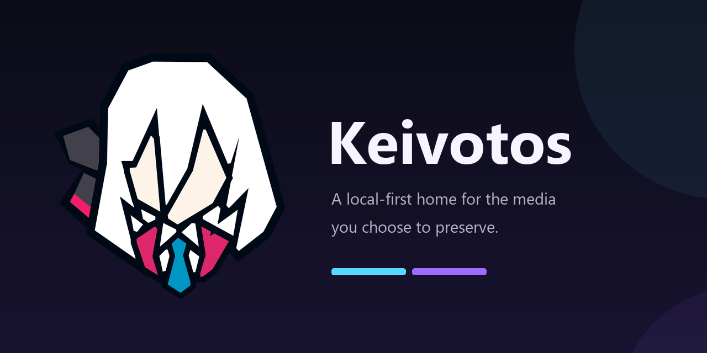

# Keivotos

Keivotos is a local-first home for the media you choose to preserve. Its first
module, **Waifu-Hoard**, is a Danbooru-inspired desktop gallery for browsing,
tagging, collecting, reviewing, and organizing an existing local image and
video library.


## What Waifu-Hoard already does

- Browse large local image/video libraries with Danbooru-style search, ratings,
  sorting, random selection, favorites, user tags, and collections.
- Index registered folders without moving the originals.
- Keep stable sidecars, local tag/wiki information, tag covers, relationships,
  duplicate review, popularity, timelapse, daily challenges, and discovery views.
- Run resumable local import/backfill tools and user-triggered acquisition through
  gallery-dl.
- Preserve irreplaceable user state separately from the rebuildable media index,
  with verified checkpoints and user-created `.whbackup` bundles.
- Remain single-user and local-first: no login, cloud account, or hotlinked remote
  media is required.

Release history and compatibility decisions are recorded in
[`CHANGELOG.md`](CHANGELOG.md), with regression coverage under `tests/`.

## Run it

### Windows portable build

1. Extract the full release folder; do not run the executable from inside the ZIP.
2. Start `Keivotos.exe`.
3. The browser opens at <http://localhost:52325/>.

The portable folder contains application resources only. Your configuration,
databases, sidecars, thumbnails, work files, and backups live under
the Windows-known `Documents\Keivotos` location, so redirected Documents paths
are respected and replacing the application folder does not replace your
library state.
`
### From a source clone or source ZIP

Install [uv](https://docs.astral.sh/uv/) and current Node.js, then run:

```powershell
.\run.bat
```

The launcher creates/synchronizes Python 3.11 from `uv.lock`, installs the locked
frontend packages when a build is needed, builds the UI, starts the backend, and
opens Keivotos. Its Windows console uses the `Keivotos - Waifu-Hoard` title and
Keivotos icon while retaining startup progress and error output. See
[`docs/build/source.md`](docs/build/source.md) for the manual commands and
development mode.

To open the same source run from trusted phones, tablets, or other computers on`
the same private network:

```powershell
.\run.bat --lan
```

The console displays the exact address to open on the other device. LAN access
is opt-in, unauthenticated, and lasts only while that source process is running;
use it only on a trusted private network. Portable `Keivotos.exe` builds remain
PC-only.

## Writable data layout

```text
Documents/Keivotos/
├── config.json                         # user-created runtime overrides
├── logs/                               # rotating keivotos.log files
├── modules/waifu-hoard/
│   ├── library/                        # optional default acquisition/media root
│   ├── danbooru.sqlite                 # rebuildable searchable index
│   ├── user.sqlite                     # irreplaceable local choices
│   ├── sidecars/                       # durable local metadata
│   ├── thumbnails/                     # derived cache
│   ├── local_recovery/                 # verified local checkpoints
│   └── gallery-dl/                     # acquisition work files
└── backups/waifu-hoard/                # default manual backup destination
```

Existing external media remains where it is. Registering a folder indexes it;
it does not copy it. Roots with the same leaf name are allowed, and Settings →
Library → Relocate reconnects an indexed root after you move it while preserving
its stable root identity and sidecars. More detail is in
[`docs/user/data-layout.md`](docs/user/data-layout.md).
Older V1.0.0 test builds that created a `metadata/` wrapper are flattened into
the module directory on the next launch; conflicting files are preserved and
startup stops instead of overwriting either copy.

## Repository map

```text
backend/          FastAPI API, SQLite schemas, services, and local metadata logic
frontend/         Svelte 5 + TypeScript web interface
scripts/          import, metadata, benchmark, and release helpers
tests/            backend regression and API snapshot tests
assets/branding/  Keivotos suite and Waifu-Hoard module brand masters
packaging/windows Windows portable-build specification and resources
docs/build/       contributor build instructions
docs/user/        installation, storage, and troubleshooting guides
.github/          issue and pull-request contribution templates
```

The project deliberately keeps its clear `backend/` and `frontend/` boundaries.
It does not add Rust-style `bin/`, `resources/`, or generic `src/` layers that
would merely hide the actual architecture.

## Build and verify

```powershell
uv sync --locked --python 3.11
uv run python -m compileall -q .\backend .\scripts .\app.py
uv run python -m unittest discover -s tests -v

Set-Location frontend
npm.cmd ci
npm.cmd run check
npm.cmd run build
```

Windows packaging is documented in
[`docs/build/windows.md`](docs/build/windows.md). Build and inspect the portable
archive locally; publishing and release creation remain deliberate maintainer
actions.

## Project direction

Keivotos is the suite; Waifu-Hoard is its first module. Waifu-Hoard-Hoarder—the
manga/CBZ experiment—is the next codebase to evaluate for the shared module
model. Manga, karaoke/music, anime/video, 2D/3D/Live2D archives, and text/thread
archives remain planned directions, not promises bundled into V1.0.0. See
[`docs/project-direction.md`](docs/project-direction.md).

## Privacy, safety, and FOSS

- Keivotos is local-first and does not introduce accounts or cloud sync.
- Destructive library operations show their scope; external originals are not
  part of metadata backup/restore.
- Keivotos source is Apache-2.0. Portable distributions include third-party
  license material; gallery-dl and FFmpeg remain separately invoked GPL tools.

Read [`CONTRIBUTING.md`](CONTRIBUTING.md), [`SECURITY.md`](SECURITY.md),
[`SUPPORT.md`](SUPPORT.md), and [`THIRD_PARTY_NOTICES.md`](THIRD_PARTY_NOTICES.md)
before contributing or redistributing a build.
